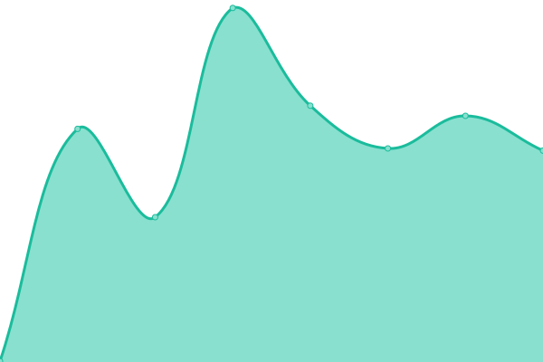
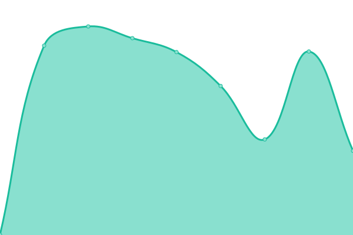
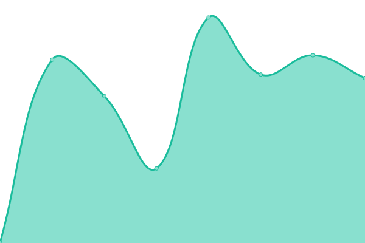

# [📈 Live Status](http://torra.ddns.net): <!--live status--> **🟧 Partial outage**

This repository contains the open-source uptime monitor and status page for [jacksonkocon](https://torra.ddns.net), powered by [Upptime](https://github.com/upptime/upptime).

With [Upptime](https://upptime.js.org), you can get your own unlimited and free uptime monitor and status page, powered entirely by a GitHub repository. We use [Issues](https://github.com/jacksonkocon/uptime/issues) as incident reports, [Actions](https://github.com/jacksonkocon/uptime/actions) as uptime monitors, and [Pages](https://torra.ddns.net) for the status page.

<!--start: status pages-->
<!-- This summary is generated by Upptime (https://github.com/upptime/upptime) -->
<!-- Do not edit this manually, your changes will be overwritten -->
<!-- prettier-ignore -->
| URL | Status | History | Response Time | Uptime |
| --- | ------ | ------- | ------------- | ------ |
|  [Torra+](http://torraplus.com) | 🟩 Up | [torra.yml](https://github.com/JacksonKocon/uptime/commits/HEAD/history/torra.yml) | 

 535ms
     
 | 

<a href="https://status.torraplus.com/history/torra">94.61%</a>
    

|  [Request](http://request.torraplus.com) | 🟥 Down | [request.yml](https://github.com/JacksonKocon/uptime/commits/HEAD/history/request.yml) | 

 1008ms
     
 | 

<a href="https://status.torraplus.com/history/request">94.72%</a>
    

|  [Account](http://account.torraplus.com) | 🟥 Down | [account.yml](https://github.com/JacksonKocon/uptime/commits/HEAD/history/account.yml) | 

 622ms
     
 | 

<a href="https://status.torraplus.com/history/account">94.96%</a>
    

<!--end: status pages-->

[**Visit our status website →**](http://torra.ddns.net)

## 📄 License

- Powered by: [Upptime](https://github.com/upptime/upptime)
- Code: [MIT](./LICENSE) © [jacksonkocon](http://torra.ddns.net)
- Data in the `./history` directory: [Open Database License](https://opendatacommons.org/licenses/odbl/1-0/)
